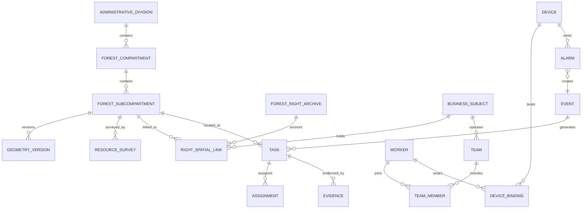

# 智慧竹山 V2 领域模型

## 1. 建模目标

V2 使用“主数据 + 业务交易 + 空间关系 + 证据审计”的分层模型。任何核心业务都必须能回答：对象是谁、发生在哪里、由谁处理、当前什么状态、依据是什么、结果是什么。

## 2. 核心对象

| 领域 | 核心实体 | 主标识 | 说明 |
| --- | --- | --- | --- |
| 组织权限 | Organization、User、Role、Position、DataScope | `org_id`、`user_id` | 组织树和数据范围独立于菜单权限 |
| 行政区划 | AdministrativeDivision | `division_code` | 省、市、县、乡、村统一层级 |
| 空间资源 | ForestCompartment、ForestSubcompartment、GeometryVersion | `block_code`、`subblock_code` | 林班与小班分层管理，边界有版本 |
| 资源调查 | ResourceSurvey、ResourceSnapshot | `survey_id` | 竹种、龄级、密度、蓄积、质量等时点数据 |
| 林权档案 | ForestRightArchive、RightSpatialLink | `archive_code` | 法律档案和空间图斑解耦关联 |
| 经营主体 | BusinessSubject、Farmer、Cooperative、Enterprise | `subject_id` | 统一主体后再扩展不同类型字段 |
| 人员班组 | Worker、Team、TeamMember、Qualification | `worker_id`、`team_id` | 实名、资质、培训和归属关系 |
| 统一运营 | Event、Task、WorkOrder、Assignment、Evidence | `event_no`、`task_no` | 跨业务统一派发、办理和留痕 |
| 巡护管护 | PatrolPlan、PatrolTask、Track、PatrolReport | `patrol_no` | 计划到问题闭环 |
| 采伐监管 | HarvestApplication、Quota、Approval、Operation、Verification | `harvest_no` | 申请到资源更新的专用状态机 |
| 劳务经营 | LaborDemand、Match、Contract、Attendance、Payroll | `contract_no` | 用工、履约、结算和信用 |
| 安全应急 | Alert、Incident、Response、Escalation、Review | `incident_no` | 告警可以合并为事件，事件触发任务 |
| 设备物联 | Device、Binding、Telemetry、Alarm、Command、Maintenance | `device_code` | 设备台账与时序数据分离 |
| 无人机 | Drone、Pilot、Mission、Route、Flight、FlightAsset | `mission_no` | 任务、飞行记录和成果资产 |
| AI 模型 | Dataset、LabelSet、Model、ModelVersion、Deployment、Evaluation | `model_code` | 数据、训练、部署、推理和评测可追溯 |
| 碳汇产业 | CarbonProject、Measurement、Transaction、Distribution | `project_code` | 后续阶段启用 |
| 平台支撑 | FileAsset、Notification、AuditLog、Dictionary | UUID | 统一附件、消息、审计和字典 |

## 3. 关键关系

## 4. 统一业务主线

### 4.1 事件状态

`new → triaged → assigned → handling → resolved → verified → closed`

- `new`：系统、设备或人员上报产生。
- `triaged`：确认事件类型、级别、位置和责任部门。
- `assigned`：生成任务并指定责任人和时限。
- `handling`：现场或后台处置中。
- `resolved`：责任人提交结果和证据。
- `verified`：复核人员确认有效。
- `closed`：业务归档，仅管理员可重新打开。

驳回不作为永久状态；复核不通过时退回 `handling` 并记录原因。自动告警重复发生时优先合并到同一开放事件，避免产生大量重复工单。

### 4.2 任务状态

`draft → pending → accepted → in_progress → submitted → completed`

取消和逾期作为状态原因及标记保存，不无限扩充主状态。用户首页只看到“待接单、进行中、待复核、已完成”，技术状态放在详情时间轴。

## 5. 三条首批专用状态机

### 5.1 成果入库

`uploaded → parsed → needs_confirmation → imported`

- 文件无错误时，从 `parsed` 直接一键正式入库。
- 有可修复异常时进入 `needs_confirmation`，集中展示错误行、重叠图斑和缺失字段。
- 普通用户只处理当前待办，不显示导出回执、操作队列和多次相同审核记录。
- 审计日志自动记录解析、确认、导入和回滚，不要求业务人员重复点击审核。

### 5.2 巡护事件

`planned → assigned → accepted → patrolling → reported → verified → closed`

轨迹、照片、视频、语音和问题点位均作为证据资产关联到巡护任务。离线期间使用客户端操作序号，恢复网络后按服务端版本进行冲突校验。

### 5.3 采伐监管

`draft → submitted → quota_check → approving → approved → operating → verifying → completed`

- 审批通过前必须关联林班/小班、林权档案、申请主体和额度依据。
- 作业阶段生成地理围栏和允许时间窗，越界、超时和无证设备触发安全事件。
- 验收完成后生成采伐批次、追溯记录并更新资源调查版本，不直接覆盖历史数据。

## 6. 数据规则

1. 所有主表使用 UUID 主键，同时提供可读业务编号。
2. 行政区划、林班、小班、林权和设备编号必须全局唯一。
3. 业务表存内部 ID 关系，API 同时返回可读编号；不再用逗号字符串保存正式关联。
4. 空间边界使用 CGCS2000 统一存储，原始坐标系和转换记录必须保留。
5. 面积以服务端空间计算结果为准，原文件面积作为来源值保留并进行差异校验。
6. 核心业务采用版本号进行并发控制，避免移动端覆盖后台新数据。
7. 删除采用软删除；法律档案、审批、告警、工资和审计记录不得物理删除。
8. 文件进入对象存储，数据库保存哈希、大小、类型、来源、权限和业务关系。
9. 设备遥测写入时序库，关系库只保留设备主数据、告警和业务摘要。
10. 指标必须登记口径、数据源、更新时间和责任模块。

## 7. V1 数据承接

| V1 对象 | V2 去向 | 迁移策略 |
| --- | --- | --- |
| `forest_blocks` | 林班/小班、边界版本、资源快照 | 识别层级后拆分，原编号保留为外部标识 |
| `forest_rights` | 林权档案、空间关联、附件 | 关联码转换为关系表 |
| `map_layers` | 图层目录、图层版本、发布记录 | 保留现有样式和大屏可见配置 |
| `business_records` | 主体档案或对应专用业务表 | 按模块映射；无法确认的数据进入迁移待办 |
| 导入批次 | 数据接入任务、质量问题、入库结果 | 保留审计证据，简化用户操作状态 |
| 用户角色 | 账号、角色、岗位、数据范围 | 权限码映射并补组织层级 |

## 8. 领域边界约束

- 林权档案不因林班资源调查更新而自动变更。
- 林班边界变更必须产生新版本并触发林权关联复核。
- 设备告警不是业务事件；只有通过规则判定或人工确认后才创建事件。
- AI 推理结果不是最终结论；需要保留模型版本、置信度和人工复核结果。
- 驾驶舱聚合表是可重建数据，不作为业务事实源。
