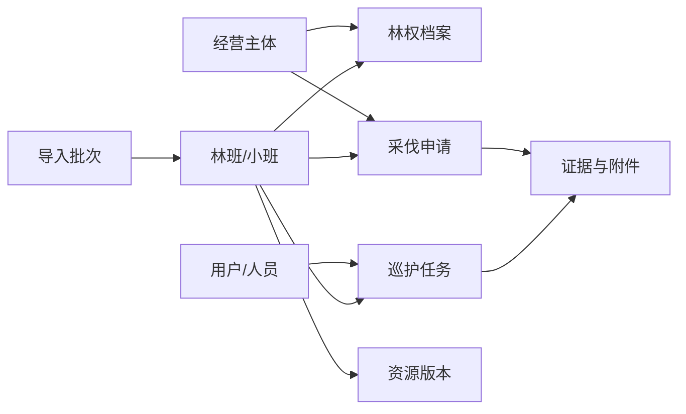

# 智慧竹山 V2 原型工程交接说明
## 1. 交接目标

`v2-prototype.html` 用于验证 V2 的信息架构、核心工作流和响应式边界。正式实现时保留已验证的页面结构和交互逻辑，但不直接复制原型中的静态业务数据、DOM 状态或内联 SVG 图标集合。

正式工程按“PC 运营端先行、共享领域模型、后端模块化单体”的方向建设：

- 前端：React、TypeScript、Vite、TanStack Router、TanStack Query。
- 地图：OpenLayers，三维场景按需加载 CesiumJS。
- 后端：FastAPI 模块化单体，统一使用 `/api/v2`。
- 数据：PostgreSQL 16 + PostGIS 3、Redis、对象存储。
- 长任务：导入、影像、报告和批量计算均返回任务 ID。

## 2. 页面与正式路由

| 原型视图 | 正式路由 | 页面职责 | 首批权限 |
| --- | --- | --- | --- |
| 我的工作台 | `/workspace` | 聚合本人待办、任务、告警和快捷入口 | `workspace.view` |
| GIS 一张图 | `/map` | 空间搜索、分层筛选、图层控制、对象钻取 | `resource.map.view` |
| 数据接入 | `/resources/imports` | 上传、解析、异常确认、正式入库和任务恢复 | `resource.imports.view/create/commit` |
| 巡护办理 | `/operations/patrol/tasks/:id` | 任务接单、执行、证据、复核和闭环 | `operations.patrol.view/execute/review` |
| 采伐办理 | `/operations/harvest/applications/:id` | 申请、额度校验、审批、作业和验收 | `operations.harvest.view/create/approve` |

路由只负责页面编排。台账、详情、选择器和办理动作必须拆为独立组件，不能在一个页面脚本中集中处理所有状态。

## 3. 前端模块拆分

```text
apps/web-operations/src/
  app/                     路由、登录态、权限守卫、错误边界
  features/workspace/      待办、任务、告警、空间摘要
  features/map/            地图、图层、筛选、对象详情
  features/imports/        上传、解析、质量问题、入库任务
  features/patrol/         巡护台账、任务详情、证据、复核
  features/harvest/        申请、审批、作业、验收
  entities/                林班、林权、主体、人员、附件
  shared/ui/               表格、抽屉、对话框、状态、表单
  shared/gis/              地图容器、空间选择器、图层控件
  shared/api/              OpenAPI 客户端、错误和任务轮询
```

### 3.1 共享组件

| 组件 | 用途 |
| --- | --- |
| `AppShell` | 侧栏、顶栏、移动导航和当前用户上下文 |
| `PermissionGate` | 菜单、按钮、字段级权限控制 |
| `DataLedger` | 服务端分页、筛选、列配置、固定操作栏 |
| `EntityDrawer` | 只读详情、关联对象、附件和时间轴 |
| `EntitySelector` | 从正式台账检索林班、林权、主体、人员和设备 |
| `WorkflowActions` | 只显示当前状态与当前角色可执行动作 |
| `AsyncTaskStatus` | 上传、导入和报告任务的进度、失败重试和恢复 |
| `MapWorkbench` | 地图画布、图层、筛选标签、工具和对象详情 |
| `EvidenceTimeline` | 轨迹、照片、附件、定位点和办理记录 |

`EntitySelector` 是跨模块关联的唯一入口。正式编号只读，不允许用户通过自由文本创建关系。

## 4. 状态管理

- TanStack Query 保存服务端事实数据、缓存和失效策略。
- 路由查询参数保存列表筛选、分页、排序和地图专题状态。
- 表单使用局部状态；离开页面前提示未保存修改。
- Zustand 仅保存跨页面 UI 状态，例如侧栏、地图底图和最近使用区域。
- 长任务保存 `taskId`，刷新页面后通过 `/api/v2/tasks/{id}` 恢复进度。
- 不在浏览器保存全量林班、小班、行政区划或附件内容。

## 5. 后端模块与接口

### 5.1 工作台

- `GET /api/v2/workspace/summary`
- `GET /api/v2/workspace/todos`
- `GET /api/v2/workspace/alerts`

服务端按用户角色和数据范围聚合，前端不自行拼接越权数据。

### 5.2 GIS 与资源对象

- `GET /api/v2/map/objects/search`
- `GET /api/v2/map/forest-blocks/tiles/{z}/{x}/{y}`
- `POST /api/v2/map/forest-blocks/query`
- `GET /api/v2/resources/forest-blocks/{id}`
- `GET /api/v2/resources/forest-blocks/{id}/relations`
- `GET /api/v2/resources/map-layers`

小比例尺返回聚合或瓦片，大比例尺按视口返回简化几何；对象详情按需加载林权、任务、事件和影像。

### 5.3 数据接入

- `POST /api/v2/imports/uploads`
- `POST /api/v2/imports/jobs`
- `GET /api/v2/imports/jobs/{id}`
- `GET /api/v2/imports/jobs/{id}/issues`
- `PATCH /api/v2/imports/jobs/{id}/issues/{issueId}`
- `POST /api/v2/imports/jobs/{id}/commit`

无异常任务解析完成后可以直接入库；有异常时只要求处理阻断项。入库必须幂等，并保存原始文件哈希、坐标系、转换参数和批次号。

### 5.4 巡护

- `GET /api/v2/operations/patrol/tasks`
- `POST /api/v2/operations/patrol/tasks`
- `GET /api/v2/operations/patrol/tasks/{id}`
- `POST /api/v2/operations/patrol/tasks/{id}/accept`
- `POST /api/v2/operations/patrol/tasks/{id}/submit`
- `POST /api/v2/operations/patrol/tasks/{id}/review`
- `POST /api/v2/operations/patrol/tasks/{id}/evidence`

状态建议为 `draft -> assigned -> accepted -> executing -> pending_review -> completed`，退回进入 `needs_revision`，取消进入终态 `cancelled`。

### 5.5 采伐

- `GET /api/v2/operations/harvest/applications`
- `POST /api/v2/operations/harvest/applications`
- `GET /api/v2/operations/harvest/applications/{id}`
- `POST /api/v2/operations/harvest/applications/{id}/submit`
- `POST /api/v2/operations/harvest/applications/{id}/approve`
- `POST /api/v2/operations/harvest/applications/{id}/return`
- `POST /api/v2/operations/harvest/applications/{id}/acceptance`

申请必须引用经营主体、有效林权档案和林班/小班。面积、额度、权属有效期和空间重叠由后端统一校验。

## 6. 领域关系



- 林班只维护空间和资源属性，林权只维护法律凭证与权利状态。
- 业务对象保存稳定 ID，业务编号用于展示和检索，不作为外键。
- 所有关联记录保留生效时间、失效时间和来源批次。
- 重要业务记录只能作废或归档，不做物理删除。

## 7. 权限与审计

- 页面进入由菜单权限控制。
- 新增、编辑、删除、审批、导入、发布分别配置操作权限。
- 查询接口必须应用本人、部门、行政区、林场或全部的数据范围。
- 林权附件、联系方式和人员证件等字段支持脱敏与单独授权。
- 高风险写操作记录操作者、来源、原因、前后值、业务单号和幂等键。
- 审计记录进入详情时间轴和系统审计模块，不单独暴露为普通用户工作流。

## 8. 原型迁移规则

1. 先建立 `AppShell`、路由、登录态、权限守卫和设计令牌。
2. 将工作台改为真实聚合接口，保留原型的信息层级。
3. 建立共享 `EntitySelector`，优先接入林班、林权和经营主体。
4. 落地数据接入异步任务，再建设 GIS 视口查询和对象详情。
5. 按巡护、采伐顺序建设业务状态机和办理页面。
6. 用 OpenAPI 生成客户端，禁止手写重复的请求类型。
7. 原型中的样例数组、延时器和前端状态变更不得进入生产代码。

## 9. 首批验收

- 五个路由可按角色访问，未授权入口和动作不可见。
- 工作台数据来自后端聚合，并可跳转到具体办理记录。
- 地图筛选默认收起，百万亩数据条件下不下载全量几何。
- KMZ、OVKML、OVOBJ 导入可恢复进度，只处理阻断异常。
- 巡护和采伐状态由后端状态机约束，不能跳过必要节点。
- 所有跨模块关系均从正式台账选择，删除源对象时受外键或业务规则保护。
- 桌面 1280px 及以上可完整办理；手机只保留任务与现场流程。
