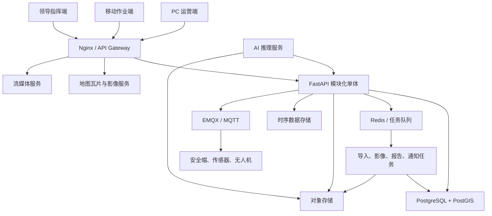

# 智慧竹山 V2 技术架构与数据迁移方案

## 1. 架构决策

V2 采用“模块化单体 + 异步任务 + GIS 专业服务 + 设备消息总线”。业务模块在同一后端工程中按领域隔离，保留统一事务和部署能力；视频、地图瓦片、AI 推理和设备遥测通过专业服务承载。



## 2. 前端架构

### 2.1 技术栈

- React、TypeScript、Vite、TanStack Router、TanStack Query。
- 组件层使用统一设计系统和表单协议，避免每个模块复制一套 CRUD 脚本。
- OpenLayers 承担二维 GIS；CesiumJS 和 3D Tiles 承担三维地形、点云和示范区数字孪生。
- 表格使用支持虚拟滚动、列配置、固定操作列和服务端分页的成熟组件。
- 移动端采用独立应用工程，地图与业务组件共享 TypeScript 模型和 API SDK。

### 2.2 工程划分

```text
apps/
  web-operations/       PC 运营端
  web-command/          领导指挥端
  mobile-field/         移动作业端
packages/
  ui/                   设计系统
  gis/                  地图与空间选择器
  api-client/           OpenAPI 生成客户端
  domain-types/         共享领域类型
  auth/                 权限与数据范围
```

### 2.3 前端性能

- 按路由和专题图层拆包，首屏不加载三维引擎和全部图标。
- 地图按视口、缩放层级和筛选条件请求聚合或瓦片。
- 列表强制服务端分页，不在浏览器保存全量林班。
- 长任务使用任务 ID 轮询或服务端事件推送，页面刷新后可恢复进度。
- 移动端使用本地任务库、增量同步、分片续传和弱网重试。

## 3. 后端架构

### 3.1 模块边界

```text
server/
  platform/       身份、组织、权限、字典、消息、审计、文件
  resources/      林班、小班、资源调查、林权、影像、图层
  operations/     任务、事件、巡护、管护、采伐、劳务
  safety/         告警、应急、人员安全、设备安全
  iot/            设备、绑定、遥测摘要、指令、维护
  drone/          无人机、飞手、航线、任务、成果
  ai/             数据集、模型、部署、推理、评测
  analytics/      指标口径、聚合、驾驶舱
  integrations/   地图、短信、设备、政务和第三方接口
```

每个模块包含 API、应用服务、领域规则、仓储和事件定义。模块只能通过公开服务或领域事件协作，不能跨模块直接修改数据表。

### 3.2 API 规范

- API 前缀统一为 `/api/v2`，V1 接口在迁移期保留适配层。
- 使用 OpenAPI 生成前端客户端和设备接入文档。
- 列表统一支持分页、排序、过滤、字段选择和数据范围。
- 写操作支持幂等键、乐观锁和审计上下文。
- 批量导入、影像处理、报告生成和大文件上传均返回任务 ID。
- 外部设备与政务接口通过集成层转换，不把供应商字段带入领域模型。

## 4. 数据架构

| 数据类型 | 推荐存储 | 说明 |
| --- | --- | --- |
| 业务与空间主数据 | PostgreSQL 16 + PostGIS 3 | 统一事务、关系和空间查询 |
| 高频设备遥测 | TimescaleDB 起步 | 与 PostgreSQL 运维体系一致 |
| 缓存、会话、队列 | Redis | 不作为事实数据源 |
| 影像、点云、视频、附件、模型 | 私有对象存储 / MinIO | 使用哈希、版本和生命周期 |
| 地图发布 | GeoServer + 矢量瓦片 + TiTiler | 分别服务业务图层、矢量和 COG |
| 日志和指标 | Loki + Prometheus + Grafana | 运行、审计和告警分开保存 |

空间数据统一保存 CGCS2000 标准结果，同时保留来源坐标系、转换参数、原始文件哈希和导入批次。影像优先转换为 COG，点云和三维成果采用 3D Tiles。

## 5. 数据库迁移

### 5.1 原则

- 当前生产 MySQL 主从保持运行，不直接原地替换。
- V2 新库先完成影子迁移和读一致性验证，再安排切换窗口。
- 不长期双写；短期增量通过变更日志或受控补偿同步。
- 每类数据都有迁移数量、关系完整性、空间有效性和抽样业务验收。

### 5.2 迁移步骤

1. 盘点：冻结 V1 表结构，输出表、字段、记录数、孤儿关系和 JSON 字段使用情况。
2. 建模：创建 V2 schema、约束、空间索引、枚举和迁移映射表。
3. 全量：从 MySQL 导出快照，转换并写入 PostgreSQL/PostGIS。
4. 校验：比较数量、主键、业务编号、关联数量、面积总量和几何有效率。
5. 补录：无法自动映射的数据生成“迁移待办”，由业务人员集中确认。
6. 增量：在试运行期间同步 V1 新增变更，记录最后同步位点。
7. 试读：V2 在只读模式访问新库，执行核心流程和性能测试。
8. 切换：维护窗口停止 V1 写入，执行最终增量、备份、切换连接并冒烟。
9. 回滚：若核心检查失败，恢复 V1 写入并保留新库用于差异分析。
10. 归档：稳定运行后将 MySQL 转为只读历史库，按批准周期下线。

### 5.3 关键校验

- 林班/小班编号唯一率 100%，有效几何率 100%。
- 林权档案数量、证号和附件哈希一致。
- 空间关联、主体关联和业务关联无孤儿记录。
- 面积汇总差异在批准阈值内，超差记录逐条进入质量待办。
- 用户、角色、权限和行政区划迁移后抽样验证不同数据范围。

## 6. 设备与视频

- MQTT 主题按租户、设备类型、设备号和消息类型分层。
- 设备消息必须包含时间戳、序号、固件版本和签名；服务端去重并校验时钟漂移。
- 告警规则在设备侧和云侧分层，云端保留原始告警和规则版本。
- 100 路视频采用 SRS 或 ZLMediaKit 集群，不经 FastAPI 转发媒体流。
- 视频带宽、转码、存储天数和并发预览单独容量测算。

## 7. AI 工程

- 模型服务与主业务解耦，统一通过版本化推理 API 调用。
- 每次推理保存模型版本、输入资产、置信度、输出结果和人工复核。
- 训练集、验证集、冻结测试集分开管理，模型验收只使用冻结测试集。
- 边缘模型由硬件供应商提供设备算力、运行时、升级和回滚能力。
- AI 结果默认作为建议或预警，不直接执行法律审批和资金结算。

## 8. 部署与高可用

当前双主机用于 V2 试点：高配主节点承载应用、空间数据库、GIS 和热数据，低配节点承载只读副本、监控和待命镜像。达到核心 99.9% 可用性前，应至少补充以下一项：

- 使用移动云托管高可用 PostgreSQL；或
- 增加第三节点建设数据库仲裁、自动故障转移和控制面；或
- 使用独立数据库高可用集群，应用节点保持无状态。

正式上线还需域名、备案、HTTPS、WAF、私有对象存储、自动快照、异地备份和恢复演练。

## 9. 安全基线

- 按等保二级设计身份鉴别、访问控制、安全审计、入侵防范和备份恢复。
- 用户密码使用强哈希，登录启用限流、锁定和可选 MFA。
- API 服务令牌与人工账号分离，密钥只保存在受控环境变量或密钥服务。
- 敏感字段按角色脱敏；附件和视频使用短期授权地址。
- 数据库、GeoServer、Redis、MQTT 管理端口不向公网开放。
- 所有高风险操作记录操作者、来源、原因、前后值和关联业务单号。

## 10. 代码演进策略

第一步先在现有仓库建立 V2 目录、OpenAPI 和数据库迁移工具，不立即删除 V1。第二步通过适配层让 V1 林班、林权和导入页面读取 V2 API。第三步逐域替换页面和模型。只有在数据迁移、回归和回滚验证完成后，才移除旧通用业务实现。
